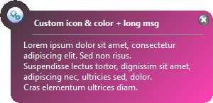
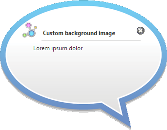

# Popup
Windows 32bits tools to display a customizable popup window (title, text, icon, background, duration)

Version 1.0.0

## Supported system
Windows XP,2003,2012,7,8,10 32bits and 64bits and certainly more

## Usage

- Syntax:

  Popup.exe -t"TITLE" -m"TEXT" [-i"ICON"] [-d"SECONDS"] [-w] [-l] [-b"IMAGE_OR_COLOR"]

- Arguments:
  
  -t : title

  -m : message text

  -i : icon: 1=INFORMATION(default), 2=WARNING, 3=ERROR, 4=OK or 'path to a custom icon image' (bmp,jpg,png,gif)

  -d : duration in seconds (default=8)

  -w : wait for previous popup to ending (not default)

  -l : lock next popups (force other popups to wait) (not default)

  -b : path to a custom background image (bmp,jpg,png,gif) or HEX formatted color for gradient background (ie:'ff0fa0')

  NOTA: Only the title and the text are required. Other parameters are optional.

## Informations and tips:
  - If mouse is over popup then it stay visible
  - Use "\n" in your text to insert a new line
  - Except if a background image is specified, an autoresize is applied for long text
  - When using background image file, the pixel at position (0,0) is used to set the transparency region
  - If "icon" is a file then it is automatically resized to 32x32 pixels

## License
GNU General Public License v3.0

Copyright (C) 2018  Noël Martinon